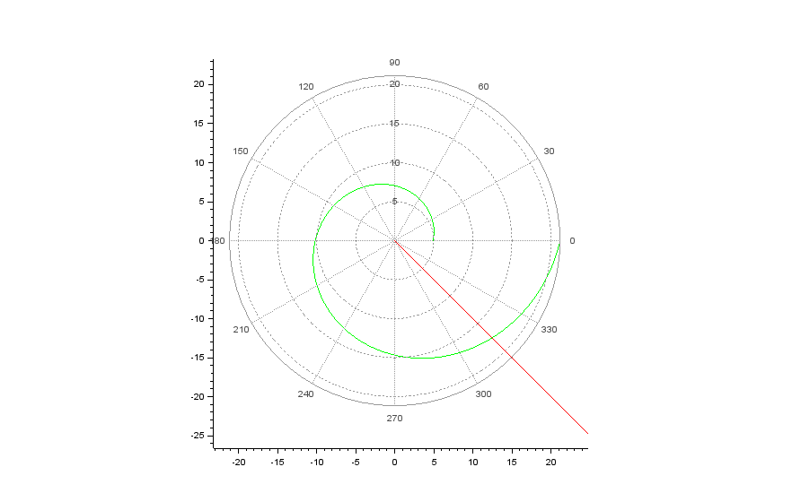
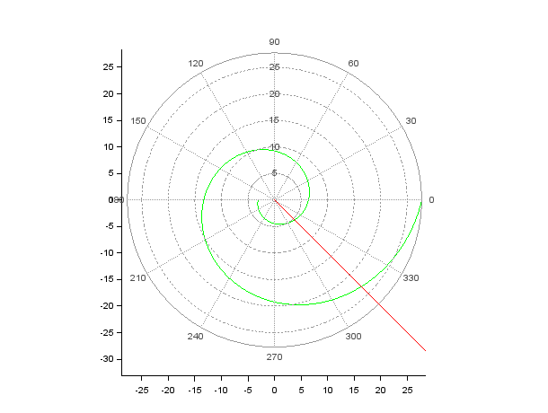

# Цель работы

Цель лабораторной работы научиться решать задачу о погоне, выводить уравнение, описывающее движение, работать с Scilab.

# Задание №47

На море в тумане катер береговой охраны преследует лодку браконьеров.
Через определенный промежуток времени туман рассеивается, и лодка
обнаруживается на расстоянии 16,6 км от катера. Затем лодка снова скрывается в
тумане и уходит прямолинейно в неизвестном направлении. Известно, что скорость
катера в 4,4 раза больше скорости браконьерской лодки.

1. Запишите уравнение, описывающее движение катера, с начальными
условиями для двух случаев (в зависимости от расположения катера
относительно лодки в начальный момент времени).
2. Постройте траекторию движения катера и лодки для двух случаев.
3. Найдите точку пересечения траектории катера и лодки


# Выполнение лабораторной работы

## Постановка задачи
1. Место нахождения лодки браконьеров в момент обнаружения:  
$$
  t_0 = 0, x_{л0} = 0
$$
  Место нахождения катера береговой охраны относительно лодки браконьеров в момент обнаружения лодки:
$$
  x_{к0} = 16.6
$$


2. Введем полярные координаты. Считаем, что полюс - это точка обнаружения лодки браконьеров,
$$
  x_{л0}  (\theta = x_{л0} = 0)
$$
   а полярная ось r проходит через точку нахождения катера береговой охраны

3. Траектория катера должна быть такой, чтобы и катер, и лодка все время были на одном расстоянии от полюса, только в этом случае траектория катера пересечется с траекторией лодки. Поэтому для начала катер береговой охраны должен двигаться некоторое время прямолинейно, пока не окажется на том же расстоянии от полюса, что и лодка браконьеров. После этого катер береговой охраны должен двигаться вокруг полюса удаляясь от него с той же скоростью, что и лодка браконьеров.


4. Чтобы найти расстояние x (расстояние, после которого катер начнет двигаться вокруг полюса), необходимо составить простое уравнение. Пусть через время t катер и лодка окажутся на одном расстоянии x от полюса. За это время лодка пройдет x, а катер — k - x (или k + x в зависимости от начального положения катера относительно полюса). Время, за которое они пройдут это расстояние, вычисляется как 
$$
  x/v
$$
  или 
$$
  {k-x}/4.4v
$$
  во втором случае
$$
  {k+x}/4.4v.
$$
  Так как время одно и то же, то эти величины одинаковы. Тогда неизвестное расстояние x можно найти из следующего уравнения:

  в первом случае
$$
  \frac{x}{v} = \frac{16.6-x}{4.4v}
$$
  во втором случае
$$
  \frac{x}{v} = \frac{16.6+x}{4.4v}.
$$


​	   Отсюда мы найдем два значения 
$$
x_1 = \frac{16.6}{3.4}   
x_2 = \frac{16.6}{5.4}
$$
​	   , задачу будем решать для двух случаев.


5. После того, как катер береговой охраны окажется на одном расстоянии от полюса, что и лодка, он должен сменить прямолинейную траекторию и начать двигаться вокруг полюса, удаляясь от него со скоростью лодки V. Для этого скорость катера раскладываем на две составляющие : 

    — радиальная скорость 
   $$
   v_r
   $$
   — тангенциальная скорость.
   $$
   v_{\tau}
   $$
   Радиальная скорость - это скорость, с которой катер удаляется от полюса:
   $$
   v_r = \frac{dr}{dt}.
   $$
   Нам нужно, чтобы эта скорость была равна скорости лодки, поэтому полагаем 
   $$
   \frac{dr}{dt}=v.
   $$
   

​		Тангенциальная скорость – это линейная скорость вращения катера относительно полюса. Она равна 
$$
v_{\tau} = r \frac{\partial \theta}{\partial t}
$$
$$
v_{\tau} = \sqrt{19.36v^2 - v^2} = \sqrt{18.36}v
$$


​		Тогда получаем 
$$
r \frac{\partial \theta}{\partial t} = \sqrt{18.36}v
$$

6. Решение исходной задачи сводится к решению системы из двух дифференциальных уравнений: 

$$
\begin{equation*} 
  \begin{cases} 
    \frac{\partial r}{\partial t} = v 
    \\
    r \frac{\partial \theta}{\partial t} = \sqrt{18.36} v 
  \end{cases}
\end{equation*}
$$

с начальными условиями 

$$
\begin{equation*}
  \begin{cases}
    \theta_0 = 0 
    \\ 
    r_0 = x_1 
  \end{cases}
\end{equation*}
$$
и
$$
\begin{equation*}
  \begin{cases}
    \theta_0 = -\pi
    \\
    r_0 = x_2
  \end{cases}
\end{equation*}
$$
Исключая из полученной системы производную по t, можно перейти к следующему уравнению:
$$
\frac{\partial r}{\partial \theta} = \frac{r}{\sqrt{18.36}}.
$$
Начальные условия остаются прежними. Решив это уравнение, мы получим траекторию движения катера в полярных координатах.

## Код программы

Данная лабораторная работа выполнялась в программе Scilab 6.1.1.
```
//начальные условия в случае 1

r0=16.6/3.4;

tetha0=0;


//начальные условия в случае 2

//r0=16.6/5.4
//tetha0=-%pi;


//функция, которая описывает движение катера береговой охраны

function dr=f(tetha, r)

    dr=r/sqrt(18.36);

endfunction;


//функция, описывающая движение лодки браконьеров

function xt=f2(t)

    xt=tan(fi)*t;

endfunction


fi=3*%pi/4;

tetha=tetha0:0.001:2*%pi;

r=ode(r0,tetha0,tetha,f);

t=0:1:800;


//построение траектории движения катера и лодки, зеленым и красным цветом соответственно 

polarplot(tetha,r,style = color('green'));

plot2d(t,f2(t),style = color('red'))

```


## Построение траектории движения

Графики движения и точки пересечения. Зелёным цветом — охрана, красным— браконьеры.

**Случай первый.** (рис.01)




**Случай второй.** (рис.02)




# Выводы

В ходе выполнения лабораторной работы я освоил Scilab, научился решать задачу о погоне и строить графики, записал уравнение, описывающее движение катера, с начальными условиями для двух случаев, построил траекторию движения катера и лодки для двух случаев, нашел точку пересечения траектории катера и лодки.

# Список литературы

Кулябов Д.С "Лабораторная работа №2": https://esystem.rudn.ru/pluginfile.php/1343800/mod_resource/content/2/Лабораторная%20работа%20№%201.pdf

