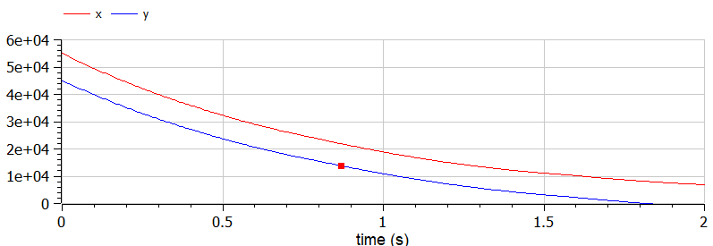
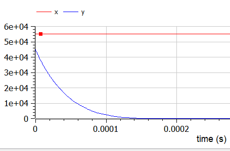

# Цель работы                                                                                                 

Рассмотреть простейшую модель боевых действий – модель Ланчестера.

# Теоретическая справка

Модель Ланчестера. В противоборстве могут принимать участие как регулярные войска, так и партизанские отряды. В общем случае главной характеристикой соперников являются численности сторон. Если в какой-то момент времени одна из численностей обращается в нуль, то данная сторона считается проигравшей (при условии, что численность другой стороны в данный момент положительна).

В этой работе ассмотри три случая ведения боевых действий: 

1. Боевые действия между регулярными войсками. 

2.  Боевые действия с участием регулярных войск и партизанских отрядов. 

3.  Боевые действия между партизанскими отрядами. 


# Выполнение работы вариант 47

Между страной Х и страной У идет война. Численность состава войск
исчисляется от начала войны, и являются временными функциями( )x t и( )y t . В
начальный момент времени страна Х имеет армию численностью 55 000 человек, а
в распоряжении страны У армия численностью в 45 000 человек. Для упрощения
модели считаем, что коэффициенты, , ,a b c h постоянны. Также считаем( )P t и( )Q t
непрерывные функции.
Постройте графики изменения численности войск армии Х и армии У для
следующих случаев:
1. Модель боевых действий между регулярными войсками
$$
dx/dt = -0,41x(t)-0,821y(t)+sin(5t)+1;
dy/dt = -0,541x(t)-0,57y(t)+cos(6t)+1.
$$

2. Модель ведение боевых действий с участием регулярных войск и партизанских отрядов 

$$
dx/dt = -0,31x(t)-0,87y(t)+|sin(4t)|;
dy/dt = -0,43x(t)y(t)-0,51y(t)+|cos(3t)|.
$$

1. Боевые действия между регулярными войсками

2. Боевые действия с участием регулярных войск и партизанских отрядов 

3. Боевые действия между партизанскими отрядами

   В первом случае численность регулярных войск определяется тремя факторами: 

   скорость уменьшения численности войск из-за причин, не связанных с боевыми действиями (болезни, травмы, дезертирство); 

   скорость потерь, обусловленных боевыми действиями противоборствующих сторон (что связанно с качеством стратегии, уровнем вооружения, профессионализмом солдат и т.п.); 

   скорость поступления подкрепления (задаётся некоторой функцией от времени). 

   

В этом случае модель боевых действий между регулярными войсками описывается следующим образом
$$
dx/dt = -a(t)x(t)-b(t)y(t)+P(t); dy/dt = -c(t)x(t)-h(t)y(t)+Q(t)
$$


Потери, не связанные с боевыми действиями, описывают члены -a(t)x(t) и -h(t)y(t) , члены -b(t)y(t) и -c(t)x(t) отражают потери на поле боя. Коэффициенты b(t) и c(t) указывают на эффективность боевых действий со стороны у и х соответственно, a(t), h(t) - величины, характеризующие степень влияния различных факторов на потери. Функции P(t), Q(t) учитывают  возможность подхода подкрепления к войскам Х и У в течение одного дня.

Во втором случае в борьбу добавляются партизанские отряды. Нерегулярные войска в отличии от постоянной армии менее уязвимы, так как действуют скрытно, в этом случае сопернику приходится действовать неизбирательно, по площадям, занимаемым партизанами. Поэтому считается, что тем потерь партизан, проводящих свои операции в разных местах на некоторой известной территории, пропорционален не только численности армейских соединений, но и численности самих партизан. В результате модель принимает вид (в этой системе все величины имею тот же смысл):
$$
dx/dt = -a(t)x(t)-b(t)y(t)+P(t); dy/dt = -c(t)x(t)y(t)-h(t)y(t)+Q(t)
$$


**Случай 1**

```
model var1
//Модель боевых действий регулярных войск
parameter Real t; //время
constant Real a=0.41; //константа, характеризующая степень влияния различных факторов на потери
constant Real b=0.821; //эффективность боевых действий для армии y
constant Real c=0.541; //эффективность боевых действий для армии x
constant Real h=0.57; //константа, характеризующая степень влияния различных факторов на потери
Real p;
Real q;
Real x;
Real y;
initial equation
x=55000; //численность армии в X
y=45000; //численность армии в Y
t=0;
equation
p=sin(5*t) + 1; //возможность подхода подкрепления к войскам X
q=cos(6*t) + 1; //возможность подхода подкрепления к войскам Y
der(x)=-a*x-b*y+p;
der(y)=-c*x-h*y+q;
end var1;
```

Получили график для первого случая (рис.1):



**Случай 2**

```
model var2
// Модель боевых действий регулярных войск и партизанских отрядов
parameter Real t; //время
constant Real a=0.31; //константа, характеризующая степень влияния различных факторов на потери
constant Real b=0.87; //эффективность боевых действий для армии y
constant Real c=0.43; //эффективность боевых действий для армии x
constant Real h=0.51; //константа, характеризующая степень влияния различных факторов на потери
Real p;
Real q;
Real x;
Real y;
initial equation
x=55000; //численность армии в X
y=45000; //численность армии в Y
t=0;
equation
p=abs(sin(4*t)); //возможность подхода подкрепления к войскам X
q=abs(cos(3*t)); //возможность подхода подкрепления к войскам Y
der(x)=-a*x-b*y+p;
der(y)=-c*x*y-h*y+q;

end var2;
```

Получили график для второго случая (рис.2):



# Вывод

В ходе выполнения лабораторной работы я рассмотрел и построил простейшую модель боевых действий – модель Ланчестера.

# Список литературы

Кулябов Д. С.  *Лабораторная работа №3*: https://esystem.rudn.ru/mod/resource/view.php?id=831037
